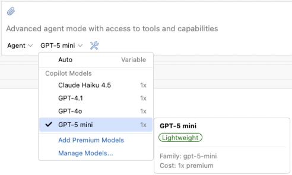
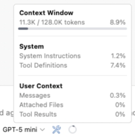

# GitHub Copilot 0.17.0 Release Notes

### GitHub Copilot for Eclipse Is Now Open Source
We're thrilled to share that GitHub Copilot for Eclipse is now open source! The full source code is available on GitHub at [microsoft/copilot-for-eclipse](https://github.com/microsoft/copilot-for-eclipse). Browse the code, file issues, and send pull requests — we'd love to build the plugin together with the Eclipse community. Your feedback and contributions help shape what comes next.

---

### Refreshed Chat View with a New Combo Picker
The chat view has been refreshed with a brand-new combo picker for selecting chat modes and models, with more information surfaced for each model.

---

### Session Context Window Usage at a Glance
Ever wonder how much of the conversation's context window has been consumed? The chat view now shows a context size donut indicator alongside the input area, with a popup that breaks down token usage for the current session. Auto compression is coming next.

---

### Custom Models (BYOK) for Copilot Business and Enterprise
Bring Your Own Key (BYOK) is now available to GitHub Copilot Business and Enterprise users — in addition to Individual users — when enabled by their organization. Once your organization turns it on, you can configure your own API keys for supported providers and use the custom models directly in Copilot chat in Eclipse. If you don't see custom models enabled, reach out to your organization's administrator to turn the feature on.

---

### Better ABAP Support
This release brings improved support for ABAP development in Eclipse. Copilot now provides more accurate and context-aware chat responses for ABAP projects, and it can read directories and search within the locally cached files.

---

### 

# GitHub Copilot 0.16.0 Release Notes

### Tool Calling in Ask Mode

Ask Mode now supports tool calling. When a question requires additional context, Copilot automatically invokes relevant tools — such as listing directories, searching for files, and reading file contents — to gather the information needed to provide an accurate response. Tools invoked in Ask Mode are read-only and will not modify your codebase.

---

### Redesigned Selectors and Chat Input Area

- **Mode and Model Selectors**: The chat mode and model selectors have been redesigned to surface more information at a glance. The updated layout includes icons and descriptions, making it easier to identify the capabilities and warnings associated with each option.

- **Chat Input Area**: The chat input area has been refined with a cleaner, borderless button design for a more streamlined appearance.

---

### Syntax Highlighting in Chat

Code snippets in Copilot's chat view now render with full syntax highlighting. Code blocks in responses are automatically highlighted based on the detected language, improving readability and making it easier to follow along with code suggestions and explanations.

---

# GitHub Copilot 0.15.0 Release Notes
### MCP Registry
Discover and install MCP servers from a centralized registry with just a few clicks. Browse available servers, view their capabilities, and add them to your workspace instantly — no manual configuration required.

<video controls="true" src="./0.15.0/mcp_registry.mp4" title="MCP Registry" style="max-width: 800px; width: 100%; height: auto;"></video>

---

### Chat View UX Enhancements
We've refreshed the chat experience with several improvements:

- **Font Size Control**: Adjust the chat view font size to your preference using keyboard shortcuts or the view menu. Use `⌘ + =` / `⌘ + -` on macOS or `Ctrl + =` / `Ctrl + -` on Windows/Linux. Make it easier on your eyes!
- **Dark Theme Refresh**: A polished dark theme with improved contrast and readability for those late-night coding sessions.
- **Undo/Redo Support**: Made a typo in your chat input? Now you can undo and redo your edits seamlessly.

<video controls="true" src="./0.15.0/chat_ux_improvements.mp4" title="Chat UX Improvements" style="max-width: 800px; width: 100%; height: auto;"></video>

---

### Editor Selection Context
Copilot now automatically includes your current editor selection in the chat context. Simply select some code, open the chat, and Copilot already knows what you're working with — making your conversations more relevant and focused.

<video controls="true" src="./0.15.0/editor_selection.mp4" title="Editor Selection Context" style="max-width: 800px; width: 100%; height: auto;"></video>

---

### Manage Todo List Tool
Stay organized with the new Todo List feature. When working on complex tasks, Copilot can now create and manage a structured todo list to track progress and plan steps. Watch as todos are checked off in real-time while the agent works through your request — giving you clear visibility into what's done and what's next.

---

### New Preferences
Fine-tune your Copilot experience with new preference options:

- **Agent Max Requests**: Control how many requests the agent can make before asking to reply 'continue', giving you more control over large, complex tasks.

  

- **Commit Instructions**: Customize how Copilot generates commit messages to match your team's conventions and style.

  

